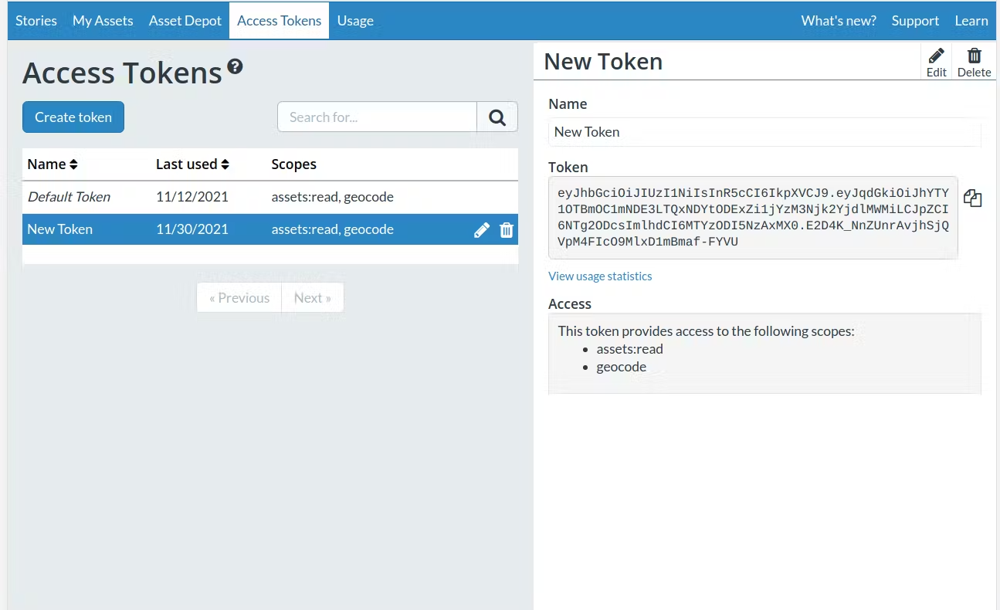

# CesiumJS Deep Dive Workshop

Stater code for the [CesiumJS Deep Dive Workshop [slides]](DevCon_CesiumJS_DeepDive.pdf), part of the 2025 Cesium Developer Conference.

This example repo is designed to get a new developer up and running with a starter [CesiumJS](https://cesium.com/platform/cesiumjs/) app. It's built using Vite and is based on [`cesium-vite-example`](https://github.com/CesiumGS/cesium-vite-example).

## Requirements

- A [Cesium ion account](https://ion.cesium.com/signup)
- [Visual Studio Code](https://code.visualstudio.com/), or an IDE of choice
- [NodeJS](https://nodejs.org/en), version 20+, with npm
  - We recommend [installing via nvm](https://nodejs.org/en/download) for first-time setup
- Optional: [Git](https://docs.github.com/en/get-started/git-basics/set-up-git#platform-all) to clone from example repo

## Setup

1. Download a copy of the code:
   - If using Git, [**fork this repository** and sync it on your local machine](https://docs.github.com/en/pull-requests/collaborating-with-pull-requests/working-with-forks/fork-a-repo) at the desired location.
   - Otherwise, [**download the source code**](https://docs.github.com/en/repositories/working-with-files/using-files/downloading-source-code-archives) and unzip to your desired location.

2. In Visual Studio Code, [open the workspace](https://code.visualstudio.com/docs/editing/workspaces/workspaces) by using **File** > **Open Folder...** and selecting the `cesiumjs-workshop` directory from the previous step.
3. Open `src/main.js`.
4. Create a new Cesium ion token.

   
   - In Cesium ion, open the [**Access Tokens**](https://ion.cesium.com/tokens?) tab.
   - Press the **Create token**, button.
   - Give the token a name and leave the default permission settings. Press **Create**.
   - Copy the contents from **Token**.

   [Learn more about managing access tokens in Cesium ion.](https://cesium.com/learn/ion/cesium-ion-access-tokens/)

   > [!TIP]
   > It’s best practice to create a unique access token for each application you develop and to grant the minimal required access in order for your app to work. See [**Security best practices for tokens**](https://cesium.com/learn/ion/cesium-ion-access-tokens/#security-best-practices-for-tokens).

5. Back in `src/main.js` replace the content of `your_ion_token_here` by pasting the access token from the previous step.
6. Open the terminal by using **Terminal** > **New Terminal**.
7. Run the following commands to setup, build, and run the app:

   ```sh
   npm install # Install project dependencies
   ```

   ```sh
   npm run dev # Build and start the development server
   ```

8. In a browser, navigate to [`http://localhost:5173/`](http://localhost:5173/)

## Developer scripts

This project includes a few tools to support development. Any of the following commands can be run in terminal.

- `npm run eslint`: Find and fix common JavaScript code issues using [ESLint](https://eslint.org/)
- `npm run prettier`: Format all the code to a consistent style using [Prettier](https://prettier.io/)
- `npm run dev`: Start a development server at [`http://localhost:5173/`](http://localhost:5173/) using [Vite](https://vite.dev/)
- `npm run build`: Run an optimized build for production and output to the `dist/` directory

## Resources

- [CesiumJS Docs](https://cesium.com/docs/cesiumjs-ref-doc/): The JavaScript API reference documentation
- [Sandcastle](https://sandcastle.cesium.com/): A live-coding environment with a large gallery of code examples
- [Cesium Community Forum](https://community.cesium.com/): Where the community and the development team ask and answer Cesium-related questions
